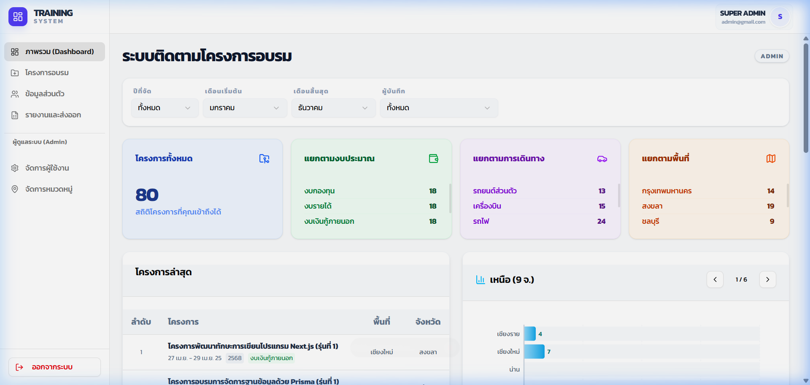
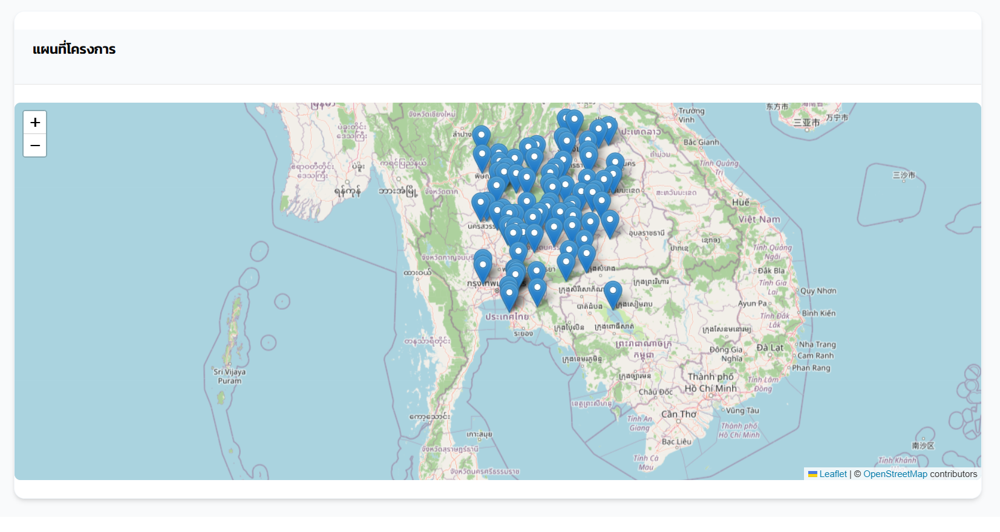
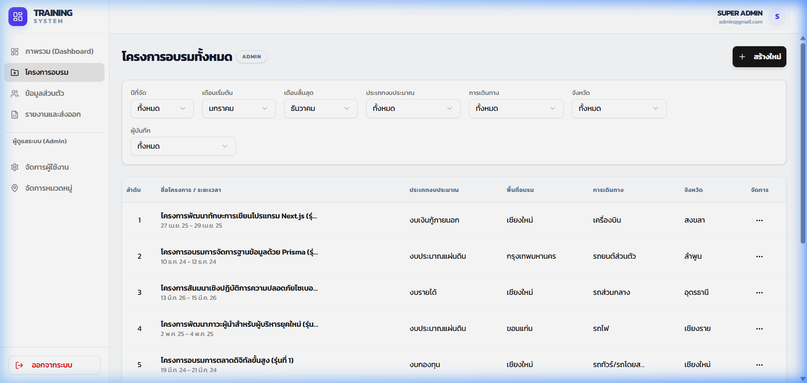
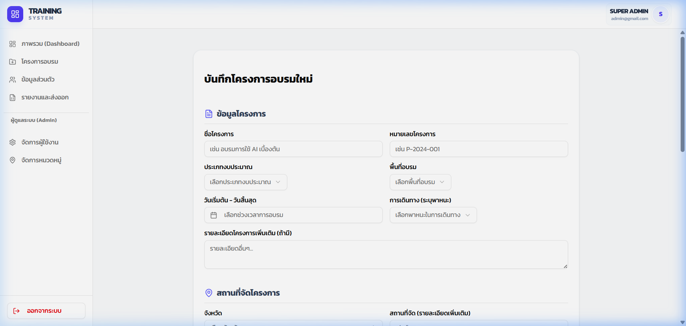
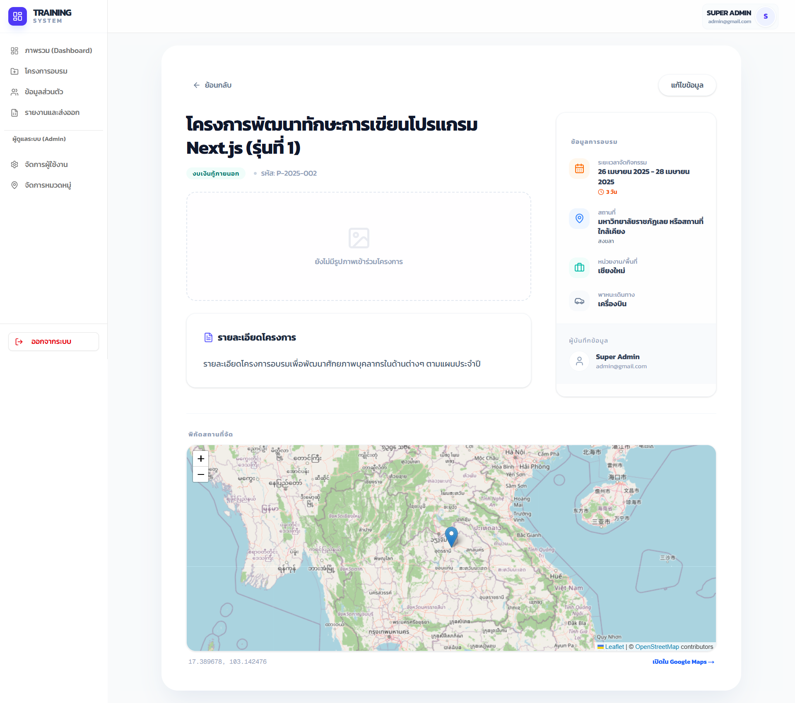

# Train Management System (TMS)

> ระบบบริหารจัดการโครงการฝึกอบรมและสถิติอัจฉริยะ — ติดตามโครงการ, วิเคราะห์งบประมาณตามประเภท, และระบุตำแหน่งพื้นที่ฝึกอบรมทั่วประเทศไทยแบบ Interactive

## -------------------------------------------------------------------

🔗 **[Live Demo](https://training-program-recording-system.vercel.app/)**

## -------------------------------------------------------------------

### Demo Credentials

| Role | Email | Password |
|---|---|---|
| **Super Admin** | `admin@gmail.com` | `123456789` |
| **Secondary Admin** | `admin2@gmail.com` | `123456789` |
| **General User** | `user@gmail.com` | `123456789` |

> [!NOTE]
> ระบบมีการแยกสิทธิ์ 3 ระดับ: **Super Admin** (สิทธิ์สูงสุด), **Admin** (ผู้ช่วยดูแลระบบ), และ **User** (ผู้บันทึกข้อมูล) เพื่อความปลอดภัยและเป็นระเบียบของข้อมูลโครงการ

---

## Screenshots & Demos

### Advanced Analytics Dashboard
หน้าแรกสรุปข้อมูลสถิติที่สำคัญ พร้อมกราฟ Recharts แสดงสัดส่วนงบประมาณและจำนวนโครงการแยกตามพื้นที่

### Geocoding & Interactive Map
ปักหมุดตำแหน่งโครงการลงบนแผนที่ Leaflet โดยรองรับระบบ Geocoding เพื่อค้นหาพิกัดจากที่อยู่จริง

### Project Life-cycle Management
ระบบจัดการโครงการที่ครบวงจร ตั้งแต่การบันทึกรหัสโครงการ จนถึงการสรุปรายงาน

### Comprehensive Form Design
แบบฟอร์มการกรอกข้อมูลโครงการที่ออกแบบมาให้ใช้งานง่าย พร้อมระบบปักหมุดอัตโนมัติ

### Excel Data Export & Reports
ระบบส่งออกรายงานโครงการเป็นไฟล์ Excel พร้อมระบบกรองข้อมูลอัจฉริยะ

### Detailed Project Insights
หน้าแสดงรายละเอียดเจาะลึกของแต่ละโครงการ รวมถึงภาพกิจกรรมและเอกสารแนบ

---

## Key Features

| Feature | รายละเอียด |
|---|---|
| **Training Project Tracking** | บันทึกและจัดการโครงการฝึกอบรมอย่างเป็นระบบ พร้อมระบบคำนวณจำนวนวันอัตโนมัติ |
| **Smart Geocoding Map** | ระบุพิกัดโครงการบนแผนที่ Interactive รองรับการแสดงผลรายโครงการและภาพรวมทั้งระบบ |
| **Budget Categorization** | วิเคราะห์และติดตามงบประมาณแยกตามประเภท (Budget Types) เพื่อความโปร่งใส |
| **Excel Data Export** | ระบบส่งออกรายงานโครงการเป็นไฟล์ Excel พร้อมระบบกรองข้อมูลตามเงื่อนไขที่ต้องการ |
| **Rich Media Storage** | ระบบจัดเก็บรูปภาพโครงการและใบประกาศนียบัตร (Certificates) ในรูปแบบ Digital Assets |
| **Complex Reporting** | ระบบรายงานขั้นสูงที่สามารถวิเคราะห์สถิติและแสดงผลในรูปแบบกราฟ (Charts) |
| **User Profile & Security** | จัดการข้อมูลส่วนตัวและระบบเปลี่ยนรหัสผ่าน พร้อมการรักษาความปลอดภัยด้วย Better-Auth |
| **Enterprise RBAC** | ควบคุมสิทธิ์การเข้าถึงข้อมูลตามบทบาทของผู้ใช้งาน (Admin / User) อย่างเข้มงวด |

---

## Tech Stack & Rationale

| Technology | Version | เหตุผลที่เลือก |
|---|---|---|
| **Next.js** (App Router) | 16.1.6 | ใช้ประสิทธิภาพสูงสุดของ Server Components และ Route Handlers |
| **React** | 19.2.3 | รองรับ Features ใหม่ๆ และการจัดการ UI ที่ซับซ้อนในหน้า Reports |
| **Prisma ORM** | 7.3.0 | มั่นใจเรื่อง Type-safety ของข้อมูลโครงการและความสัมพันธ์ของหมวดหมู่ต่างๆ |
| **PostgreSQL** | 16 | ฐานข้อมูลประสิทธิภาพสูง รองรับ Query ข้อมูลรายงานที่มีความซับซ้อน |
| **Better-Auth** | 1.4.18 | ระบบจัดการความปลอดภัยและ Session ที่ทันสมัยและยืดหยุ่น |
| **Supabase** | Cloud | โซลูชัน Backend สำหรับ Database และ Storage ที่เสถียรและขยายตัวได้ง่าย |
| **Vercel** | Edge | Deployment Platform — รองรับ Edge Functions และ ISR สำหรับความเร็วสูงสุด |

---

## User Roles & Permissions

| สิทธิ์การใช้งาน | Super Admin | Admin | User |
|---|:---:|:---:|:---:|
| ดูและค้นหาโครงการทั้งหมด | ✅ | ✅ | ✅ |
| เพิ่ม/แก้ไขข้อมูลโครงการของตนเอง | ✅ | ✅ | ✅ |
| ดูรายงานและสถิติภาพรวม | ✅ | ✅ | ✅ |
| ส่งออกรายงานเป็นไฟล์ Excel | ✅ | ✅ | ✅ |
| ส่งออกรายงาน Excel ตามชื่อผู้บันทึก | ✅ | ✅ | ❌ |
| จัดการข้อมูลพื้นที่/งบประมาณ/พาหนะ | ✅ | ✅ | ❌ |
| จัดการข้อมูลผู้ใช้ทั่วไป (USER) | ✅ | ✅ | ❌ |
| เปลี่ยนบทบาทผู้ใช้งาน (Role Change) | ✅ | ❌ | ❌ |
| จัดการ/แก้ไขแอดมินคนอื่นๆ | ✅ | ❌ | ❌ |
| จัดการข้อมูลแอดมินสูงสุด (ยกเว้นเปลี่ยนบทบาทตัวเอง) | ✅ | ❌ | ❌ |

---

## About the Developer

**คุณสุรสิทธิ์ พิมพ์สีดา (Surasit Phimseeda)**

- [surasit.phimseeda111@gmail.com](mailto:surasit.phimseeda111@gmail.com)
- [github.com/Surasit111](https://github.com/Surasit111)

---

## License

This project is proprietary software. All rights reserved.

---

*Developed with ❤️ for excellence in Training Management.*
